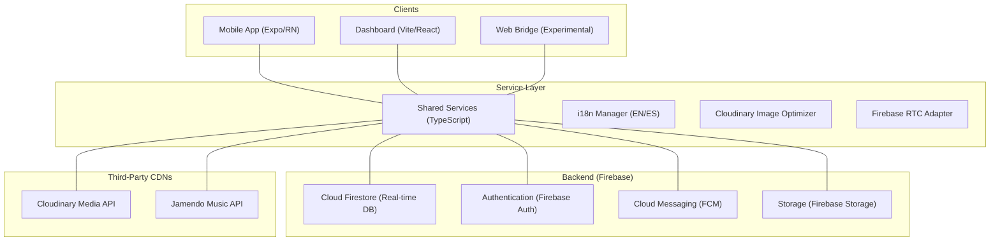

# 🏗️ CampusHub Technical Architecture

CampusHub is built on a modular, multi-platform architecture designed for high availability and real-time interaction. It leverages a monorepo structure to share critical business logic across mobile, web, and administrative dashboard environments.

---

## 🌎 High-Level Overview

The following diagram illustrates the interconnected nature of the CampusHub ecosystem:

---

## 🧩 Core Architectural Components

### 1. Unified Service Layer (`/shared`)
To maintain consistency and reduce code duplication, all platforms consume a central **Shared Logic** layer.
- **Service Factory**: Standardized Firestore abstractions for Crud operations, social interactions (Likes/Comments), and messaging.
- **Universal Types**: Single source of truth for TypeScript interfaces (e.g., `Message`, `Post`, `User`, `Notification`).

### 2. Multi-Platform Mobile (`/mobile`)
Built with **Expo (React Native SDK 52+)**.
- **FileSystem-based Routing**: Utilizes `expo-router` for a declarative and scalable navigation hierarchy.
- **Advanced UI/UX**: Custom themed components (Ivory, Dark, Dynamic) with high-performance animations powered by `react-native-reanimated`.
- **Media Bridge**: Proprietary `Cloudinary` adapter that supports both native file handling and a specialized `fetch-blob` bridge for **Expo Web** compatibility.

### 3. Localization Strategy (i18n)
CampusHub implements a **strict localization policy**:
- **Codebase Language**: English-only for all code, variables, comments, and strings.
- **Runtime Localization**: Uses `react-i18next` with `es.json` and `en.json`.
- **Primary Fallbacks**: All hardcoded fallbacks (`t('key') || 'Fallback'`) are strictly in **English**. Spanish translations are treated as the secondary presentation layer.

---

## 💾 Data Synchronization & Real-time Flow

1. **Reactive Updates**: Utilizes Firestore's `onSnapshot` for instantaneous chat updates, live post counts, and real-time notification delivery.
2. **Media Processing**: 
   - Media is uploaded through the shared `uploadService`.
   - Native mobile uses direct file streams.
   - Web platform uses an internal `fetch-blob` transformation to ensure Cloudinary compatibility through standard `multipart/form-data`.
3. **Paging & Optimization**:
   - Lists are incrementally loaded (paged) to maintain low memory usage on low-end devices.
   - `LazyImage` components use a blurred placeholder technique for progressive loading.

---

## 🔐 Security Framework

Security is baked into the Firestore ruleset (`firebase/firestore.rules`):
- **Role-Based Access Control (RBAC)**: Distinct permissions for `Admin`, `Teacher`, and `Student`.
- **Encryption**: All P2P video and audio calls are secured via WebRTC's native SRTP encryption.
- **Private Access**: Private messaging rules ensure messages can only be read or written by conversation participants.

---

## ⚙️ CI/CD & Deployment

- **Mobile**: Built and distributed via **EAS (Expo Application Services)** for Play Store/App Store readiness.
- **Web**: Deployed on high-availability edge nodes (Vercel/Firebase Hosting).
- **Backend**: Managed via Firebase CLI with environment-specific configurations (`production` vs `staging`).
