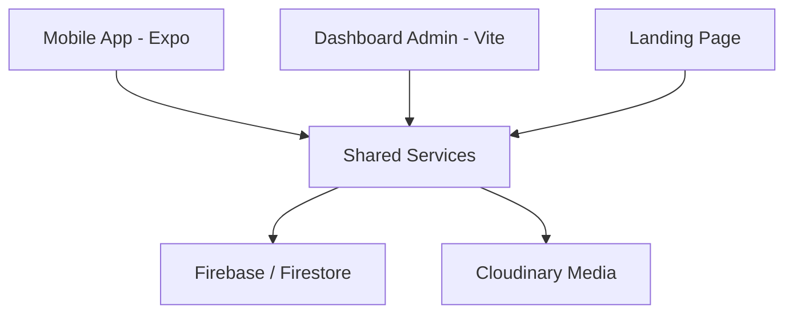

# Arquitectura de CampusHub

CampusHub es una plataforma modular diseñada para la gestión universitaria y la interacción social. El proyecto utiliza una arquitectura de monorepositorio con lógica compartida.

## Visión General

## Componentes Principales

### 1. Mobile App (`/mobile`)
Construida con **Expo (React Native)** y **TypeScript**.
- **Navegación**: Expo Router (basado en archivos).
- **Temas**: Contexto personalizado para soporte Ivory/Dark/Dynamic.
- **Estado Local**: React Context y Hooks personalizados.

### 2. Dashboard (`/dashboard`)
Panel de administración construido con **Vite** y **React**.
- **Gestión**: Usuarios, Carreras, Asignaturas y Anuncios.
- **Seguridad**: Filtrado por roles (Admin/Moderador).

### 3. Shared Layer (`/shared`)
Contiene la lógica de negocio consumida por todas las plataformas.
- **Services**: Abstracciones de Firebase (Auth, Firestore, Messaging).
- **Types**: Definiciones de TypeScript unificadas.

## Flujo de Datos

1. **Firestore**: Base de datos NoSQL en tiempo real para chats, posts y anuncios.
2. **Cloudinary**: Gestión de archivos multimedia (imágenes/videos) optimizada.
3. **WebRTC**: Comunicación punto a punto para llamadas de audio y video.

## Optimizaciones de Rendimiento

- **Paginación**: Implementada en todos los feeds principales para evitar sobrecarga de memoria.
- **Memoización**: Uso extensivo de `React.memo` en componentes de listas costosos.
- **Lazy Loading**: Componente `LazyImage` personalizado para carga progresiva de recursos.
