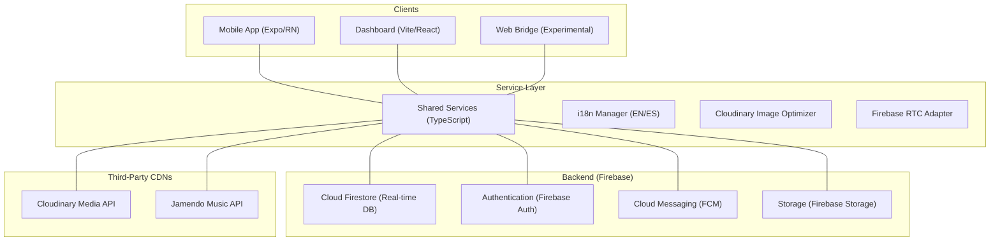

# 🏗️ CampusHub Technical Architecture

CampusHub is built on a modular, multi-platform architecture designed for high availability and real-time interaction. It leverages a monorepo structure to share critical business logic across mobile, web, and administrative dashboard environments.

---

## 🌎 High-Level Overview

The following diagram illustrates the interconnected nature of the CampusHub ecosystem:

---

## 🧩 Core Architectural Components

### 1. Unified Service Layer (`/shared`)
To maintain consistency and reduce code duplication, all platforms consume a central **Shared Logic** layer.
- **Service Factory**: Standardized Firestore abstractions for Crud operations, social interactions (Likes/Comments), and messaging.
- **Universal Types**: Single source of truth for TypeScript interfaces (e.g., `Message`, `Post`, `User`, `Notification`).

### 2. Multi-Platform Mobile (`/mobile`)
Built with **Expo (React Native SDK 52+)**.
- **FileSystem-based Routing**: Utilizes `expo-router` for a declarative and scalable navigation hierarchy.
- **Advanced UI/UX**: Custom themed components (Ivory, Dark, Dynamic) with high-performance animations powered by `react-native-reanimated`.
- **Media Bridge**: Proprietary `Cloudinary` adapter that supports both native file handling and a specialized `fetch-blob` bridge for **Expo Web** compatibility.

### 3. Localization Strategy (i18n)
CampusHub implements a **strict localization policy**:
- **Codebase Language**: English-only for all code, variables, comments, and strings.
- **Runtime Localization**: Uses `react-i18next` with `es.json` and `en.json`.
- **Primary Fallbacks**: All hardcoded fallbacks (`t('key') || 'Fallback'`) are strictly in **English**. Spanish translations are treated as the secondary presentation layer.

---

## 💾 Data Synchronization & Real-time Flow

1. **Reactive Updates**: Utilizes Firestore's `onSnapshot` for instantaneous chat updates, live post counts, and real-time notification delivery.
2. **Media Processing**: 
   - Media is uploaded through the shared `uploadService`.
   - Native mobile uses direct file streams.
   - Web platform uses an internal `fetch-blob` transformation to ensure Cloudinary compatibility through standard `multipart/form-data`.
3. **Paging & Optimization**:
   - Lists are incrementally loaded (paged) to maintain low memory usage on low-end devices.
   - `LazyImage` components use a blurred placeholder technique for progressive loading.

---

## 🔐 Security Framework

Security is baked into the Firestore ruleset (`firebase/firestore.rules`):
- **Role-Based Access Control (RBAC)**: Distinct permissions for `Admin`, `Teacher`, and `Student`.
- **Encryption**: All P2P video and audio calls are secured via WebRTC's native SRTP encryption.
- **Private Access**: Private messaging rules ensure messages can only be read or written by conversation participants.

---

## ⚙️ CI/CD & Deployment

- **Mobile**: Built and distributed via **EAS (Expo Application Services)** for Play Store/App Store readiness.
- **Web**: Deployed on Vercel — [campus-hub-one-alpha.vercel.app](https://campus-hub-one-alpha.vercel.app/). Built with `npm run build` inside `/web`.
- **Desktop**: Packaged with Electron Builder via `npm run electron:build` inside `/desktop`. Generates `.exe` (Windows), `.dmg` (macOS) and `.AppImage` (Linux) under `/release`.
- **Backend**: Managed via Firebase CLI with environment-specific configurations (`production` vs `staging`).

---

## 🗄️ Firestore Database Schema

CampusHub stores all data across the following Firestore collections:

| Collection | Description | Key fields |
|------------|-------------|------------|
| `users` | Registered users | `uid`, `email`, `displayName`, `role`, `department`, `fcmToken`, `lastActive` |
| `channels` | Communication channels | `name`, `type` (public/private/announcement), `departmentRestricted`, `lastMessageAt` |
| `channels/{id}/messages` | Channel messages | `text`, `senderId`, `attachments`, `reactions`, `createdAt` |
| `channels/{id}/members` | Channel members | `userId`, `role`, `lastRead`, `notifications` |
| `conversations` | 1-on-1 direct chats | `participants[]`, `lastMessage`, `unreadCount`, `lastMessageAt` |
| `conversations/{id}/messages` | Direct messages | `text`, `senderId`, `read`, `readAt`, `attachments` |
| `calls` | WebRTC calls | `callerId`, `receiverId`, `type`, `status`, `offer`, `answer` |
| `calls/{id}/callerCandidates` | ICE candidates (caller) | `candidate`, `sdpMLineIndex`, `sdpMid` |
| `calls/{id}/receiverCandidates` | ICE candidates (receiver) | `candidate`, `sdpMLineIndex`, `sdpMid` |
| `friendRequests` | Friend requests | `fromUserId`, `toUserId`, `status` (pending/accepted/rejected) |
| `friendships` | Confirmed friendships | `userId`, `friendId`, `createdAt` |
| `events` | Academic events | `title`, `category`, `startDate`, `endDate`, `status`, `attendeesCount` |
| `rsvps` | Event attendance | `eventId`, `userId`, `status` (going/maybe/not_going) |
| `posts` | Forum posts | `title`, `content`, `category`, `authorId`, `likesCount`, `commentsCount` |
| `notifications` | Push notification log | `userId`, `title`, `body`, `status` (pending/sent/failed) |
| `roles` | Role & permission definitions | `name`, `permissions` (canCreateChannels, canDeleteMessages…) |

**Active Cloud Functions** (triggered automatically by Firestore events):
- `onMessageCreated` — notifies channel members on new message.
- `onCallInitiated` — notifies call receiver of incoming call.
- `onFriendRequestCreated` — notifies recipient of a friend request.
- `onDirectMessageCreated` — notifies recipient of a direct message.

---

## 🧰 Shared Services Reference

All services live in `shared/services/` and follow a dependency-injection pattern — Firebase instances are passed via the constructor so the same class works across mobile, web, and desktop.

| Service | File | Responsibility |
|---------|------|----------------|
| `AuthService` | `authService.js` | Sign up, sign in (email + Google), session management, account deletion |
| `MessageService` | `messageService.js` | Send, receive (real-time), and paginate channel messages |
| `DirectMessageService` | `directMessageService.js` | 1-on-1 conversations, last message state |
| `ChannelService` | `channelService.js` | Channel creation, membership management |
| `GroupsService` | `groupsService.js` | Study groups: creation, members, integrated video calls |
| `CallService` | `callService.js` | WebRTC call lifecycle (offer, answer, ICE candidates, status) |
| `NotificationService` | `notificationService.js` | FCM token registration, push notification dispatch |
| `FriendsService` | `friendsService.js` | Friend requests, acceptance, contact listing |
| `ForumService` | `forumService.js` | Forum posts, comments, likes |
| `EventsService` | `eventsService.js` | Academic events, RSVP, category filtering |

Test coverage target: **70%**. Currently covered: `AuthService`, `ChannelService`, `MessageService`.

---

## 📐 Code Standards

| Aspect | Convention |
|--------|-----------|
| **Code language** | English-only: variables, functions, comments, and fallback strings |
| **Components** | Functional with hooks — no class components |
| **Styles** | Design-system tokens (`@/constants/styles`) — no magic numbers |
| **i18n** | `useTranslation()` for all visible text; fallback always in English (`\|\| 'English'`) |
| **Business logic** | Always in `/shared` services — never inside UI components |
| **Naming** | camelCase for variables/functions; PascalCase for components and classes |
| **File structure** | One component per file; filename = component name |

**What we would improve in a rewrite:**
1. **Migrate `/shared/services` to TypeScript** — currently JavaScript, which reduces type safety across all platforms.
2. **Broader automated testing** — integration tests with the Firestore emulator and E2E tests with Playwright/Detox.
3. **SFU server for group calls** — Mesh P2P doesn't scale beyond ~4 participants; a mediasoup SFU would be needed for larger groups.
4. **Offline mode** — Firestore offline persistence for use without an active connection.
5. **Code-signed desktop installer** — avoid SmartScreen warnings on Windows.
6. **Global state management** — evaluate Zustand for screens with complex shared state instead of context + props drilling.
