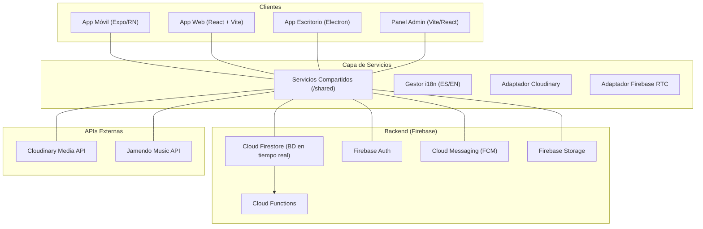

# 🏗️ Arquitectura Técnica — CampusHub

CampusHub está construido sobre una arquitectura **monorepo multi-plataforma** diseñada para alta disponibilidad e interacción en tiempo real. Comparte la lógica de negocio central entre todas las plataformas mediante una capa de servicios unificada.

---

## 🌎 Visión General

El siguiente diagrama muestra la estructura interconectada del ecosistema CampusHub:



---

## 🧩 Componentes Arquitectónicos Principales

### 1. Capa de Servicios Unificada (`/shared`)
Para mantener consistencia y eliminar duplicación de código, todas las plataformas consumen una única capa de lógica compartida.
- **Servicios**: Abstracciones estandarizadas de Firestore para operaciones CRUD, interacciones sociales (likes, comentarios) y mensajería.
- **Tipos universales**: Fuente única de verdad para las interfaces TypeScript (`Message`, `Post`, `User`, `Notification`).
- **Patrón**: Inyección de dependencias — las instancias de Firebase se pasan por constructor, lo que permite reutilizar la misma clase en cualquier plataforma.

### 2. App Móvil (`/mobile`) — Expo + React Native SDK 52
- **Enrutamiento**: `expo-router` con navegación declarativa basada en sistema de ficheros.
- **UI/UX**: Componentes temáticos (Ivory, Dark, Dinámico) con animaciones de alto rendimiento mediante `react-native-reanimated`.
- **Puente multimedia**: Adaptador Cloudinary propio que soporta flujos de archivo nativos en móvil y un puente `fetch-blob` para compatibilidad con Expo Web.

### 3. App Web (`/web`) — React 19 + Vite + TypeScript
- **Despliegue**: Vercel — [campus-hub-one-alpha.vercel.app](https://campus-hub-one-alpha.vercel.app/)
- **Funcionalidades exclusivas**: Document Picture-in-Picture (Chrome 116+), compartición de pantalla, selector avanzado de dispositivos de audio/vídeo, modo deafen.
- **Routing**: React Router v6.

### 4. App de Escritorio (`/desktop`) — Electron + React + TypeScript
- **Despliegue**: Ejecutable nativo generado con Electron Builder (`.exe` Windows / `.dmg` macOS / `.AppImage` Linux).
- **Ventajas nativas**: Notificaciones del sistema operativo, badge de mensajes no leídos en la barra de tareas, Picture-in-Picture nativo.

### 5. Estrategia de Localización (i18n)
CampusHub implementa una **política estricta de localización**:
- **Idioma del código**: Inglés obligatorio en variables, funciones, comentarios y strings.
- **Localización en tiempo de ejecución**: `react-i18next` con `es.json` y `en.json` (más de 878 claves).
- **Fallbacks**: Siempre en inglés (`t('key') || 'English text'`). El español es la capa de presentación secundaria.

---

## 💾 Sincronización de Datos y Flujo en Tiempo Real

1. **Actualizaciones reactivas**: Firestore's `onSnapshot` para actualizaciones instantáneas de chats, contadores de likes y notificaciones en tiempo real.
2. **Procesamiento de medios**:
   - Los archivos se suben a través del servicio compartido `uploadService`.
   - Móvil nativo usa flujos de archivo directos.
   - La plataforma web usa una transformación interna `fetch-blob` para garantizar compatibilidad con Cloudinary mediante `multipart/form-data`.
3. **Paginación y optimización**:
   - Las listas se cargan de forma incremental para mantener bajo uso de memoria en dispositivos de gama baja.
   - Los componentes `LazyImage` utilizan una técnica de placeholder borroso para carga progresiva.

---

## 📞 Módulo de Llamadas WebRTC

La señalización se realiza íntegramente a través de Firestore, sin servidor dedicado:

1. El llamante crea una `RTCPeerConnection` con servidores STUN de Google (NAT traversal).
2. Genera una **offer** (SDP) y la escribe en la colección `calls` de Firestore.
3. El receptor lee la offer, genera una **answer** y la escribe en el mismo documento.
4. Los ICE candidates se intercambian en subcolecciones `callerCandidates` / `receiverCandidates`.
5. Establecida la conexión, el audio y vídeo viajan **directamente entre dispositivos** (P2P), cifrados con SRTP.

**Llamadas grupales (Mesh P2P completo):** cada participante establece una `RTCPeerConnection` independiente con todos los demás. La función `getConnectionId(uid1, uid2)` genera un ID determinista por par. Un sistema de `pendingCandidates` resuelve la race condition en la que los ICE candidates llegan antes de que `remoteDescription` esté establecido.

| Tipo | Descripción | Componente |
|------|-------------|-----------|
| Llamada 1 a 1 | Voz o vídeo entre dos usuarios desde un DM | `CallScreen` |
| Llamada grupal | Voz o vídeo en grupos de conversación privados | `GroupCallScreen` |
| Videoconferencia | Sala de grupos de estudio con control de admisión | `ConferenceScreen` |

---

## 🔐 Seguridad

Las reglas de Firestore (`firebase/firestore.rules`) implementan **Control de Acceso Basado en Roles (RBAC)**:
- **Usuarios**: solo pueden leer/editar su propio perfil.
- **Canales públicos**: cualquier usuario autenticado puede leer.
- **Canales privados**: solo los miembros pueden leer/escribir.
- **Mensajes**: solo miembros del canal/conversación pueden acceder.
- **Llamadas**: solo el llamante y el receptor pueden leer/escribir.
- **Roles**: solo los admins pueden modificar.

Las llamadas WebRTC están cifradas con **SRTP** (protocolo nativo de WebRTC).

---

## ⚙️ Despliegue por Plataforma

| Plataforma | Comando | Resultado |
|------------|---------|-----------|
| **Móvil** | `eas build --platform android\|ios --profile production` | Build Play Store / App Store |
| **Web** | `cd web && npm run build` | Bundle en `/dist`, desplegado en Vercel |
| **Escritorio** | `cd desktop && npm run electron:build` | `.exe` / `.dmg` / `.AppImage` en `/release` |
| **Backend** | `firebase deploy --only firestore:rules` | Reglas en producción |

---

## 🗄️ Esquema de Base de Datos (Firestore)

| Colección | Descripción | Campos clave |
|-----------|-------------|-------------|
| `users` | Usuarios registrados | `uid`, `email`, `displayName`, `role`, `department`, `fcmToken`, `lastActive` |
| `channels` | Canales de comunicación | `name`, `type` (public/private/announcement), `departmentRestricted`, `lastMessageAt` |
| `channels/{id}/messages` | Mensajes de canal | `text`, `senderId`, `attachments`, `reactions`, `createdAt` |
| `channels/{id}/members` | Miembros del canal | `userId`, `role`, `lastRead`, `notifications` |
| `conversations` | Chats directos 1 a 1 | `participants[]`, `lastMessage`, `unreadCount`, `lastMessageAt` |
| `conversations/{id}/messages` | Mensajes directos | `text`, `senderId`, `read`, `readAt`, `attachments` |
| `calls` | Llamadas WebRTC | `callerId`, `receiverId`, `type`, `status`, `offer`, `answer` |
| `calls/{id}/callerCandidates` | ICE candidates del llamante | `candidate`, `sdpMLineIndex`, `sdpMid` |
| `calls/{id}/receiverCandidates` | ICE candidates del receptor | `candidate`, `sdpMLineIndex`, `sdpMid` |
| `friendRequests` | Solicitudes de amistad | `fromUserId`, `toUserId`, `status` (pending/accepted/rejected) |
| `friendships` | Amistades confirmadas | `userId`, `friendId`, `createdAt` |
| `events` | Eventos académicos | `title`, `category`, `startDate`, `endDate`, `status`, `attendeesCount` |
| `rsvps` | Asistencia a eventos | `eventId`, `userId`, `status` (going/maybe/not_going) |
| `posts` | Posts del foro | `title`, `content`, `category`, `authorId`, `likesCount`, `commentsCount` |
| `notifications` | Log de notificaciones push | `userId`, `title`, `body`, `status` (pending/sent/failed) |
| `roles` | Roles y permisos del sistema | `name`, `permissions` (canCreateChannels, canDeleteMessages…) |

**Cloud Functions activas** (disparadas automáticamente por eventos de Firestore):
- `onMessageCreated` — notifica a los miembros del canal cuando llega un mensaje.
- `onCallInitiated` — notifica al receptor de una llamada entrante.
- `onFriendRequestCreated` — notifica al destinatario de una solicitud de amistad.
- `onDirectMessageCreated` — notifica al receptor de un mensaje directo.

---

## 🧰 Referencia de Servicios Compartidos

| Servicio | Archivo | Responsabilidad |
|----------|---------|----------------|
| `AuthService` | `authService.js` | Registro, login (email + Google), gestión de sesión, eliminación de cuenta |
| `MessageService` | `messageService.js` | Envío, recepción en tiempo real y paginación de mensajes en canales |
| `DirectMessageService` | `directMessageService.js` | Conversaciones privadas 1 a 1, estado del último mensaje |
| `ChannelService` | `channelService.js` | Creación y gestión de canales, membresía |
| `GroupsService` | `groupsService.js` | Grupos de estudio: creación, miembros, videollamadas integradas |
| `CallService` | `callService.js` | Ciclo de vida de llamadas WebRTC (offer, answer, ICE, estado) |
| `NotificationService` | `notificationService.js` | Registro de token FCM, envío de notificaciones push |
| `FriendsService` | `friendsService.js` | Solicitudes de amistad, aceptación, listado de contactos |
| `ForumService` | `forumService.js` | Posts del foro, comentarios, likes |
| `EventsService` | `eventsService.js` | Eventos académicos, RSVP, filtrado por categoría |

Cobertura de tests actual: `AuthService`, `ChannelService`, `MessageService`. Objetivo: **70%**.

---

## 📐 Estándares de Código

### Convenciones utilizadas

| Aspecto | Convención |
|---------|-----------|
| **Idioma del código** | Inglés obligatorio en variables, funciones, comentarios y strings de respaldo |
| **Componentes** | Funcionales con hooks; sin componentes de clase |
| **Estilos** | Tokens del sistema de diseño (`@/constants/styles`); sin números mágicos |
| **i18n** | `useTranslation()` para todo texto visible; fallback siempre en inglés |
| **Lógica de negocio** | Siempre en servicios de `/shared`; nunca en componentes de UI |
| **Nomenclatura** | camelCase para variables/funciones; PascalCase para componentes y clases |
| **Ficheros** | Un componente por fichero; el nombre del fichero = nombre del componente |

### Organización del código

```
web/src/  (misma estructura en mobile/ y desktop/)
├── components/   → Componentes reutilizables por dominio (call/, campus/, chat/…)
├── contexts/     → Providers globales (CallContext, ThemeContext, LanguageContext…)
├── hooks/        → Custom hooks desacoplados por dominio de negocio
├── pages/        → Vistas organizadas por sección (auth/, campus/, chat/, admin/…)
├── services/     → Instancias de servicios configuradas para la plataforma
├── locales/      → Traducciones ES / EN
├── types/        → Interfaces TypeScript globales
└── utils/        → Helpers (formateo de fechas, colores…)
```

### Qué mejoraríamos si lo rehiciéramos

1. **Migrar `/shared/services` a TypeScript** — actualmente en JavaScript, lo que reduce la seguridad de tipos en toda la capa de servicios.
2. **Testing más amplio** — tests de integración con el emulador de Firestore y tests E2E con Playwright o Detox.
3. **Servidor SFU para llamadas grupales** — la arquitectura Mesh P2P no escala más allá de ~4 participantes; se necesitaría mediasoup para grupos grandes.
4. **Modo offline** — implementar persistencia local con Firestore offline persistence.
5. **Firma del instalador de escritorio** — evitar alertas de SmartScreen en Windows.
6. **Gestión de estado global** — evaluar Zustand para pantallas con estado compartido complejo.

---

*A&S Technologies — CIFP Villa de Agüimes, 2026.*
