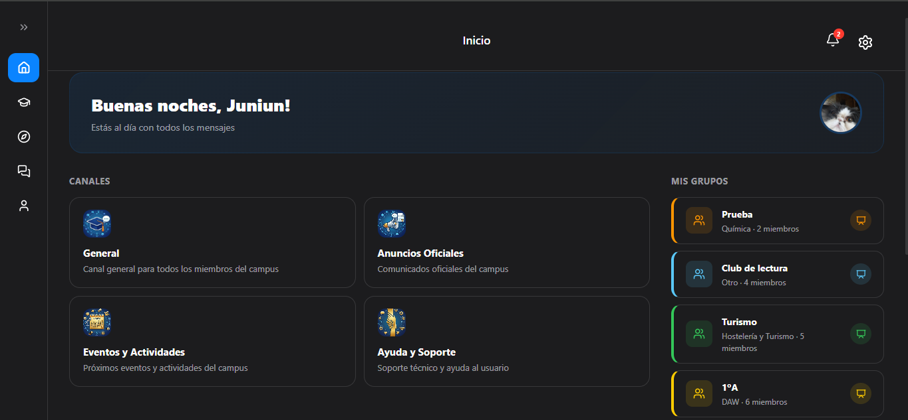
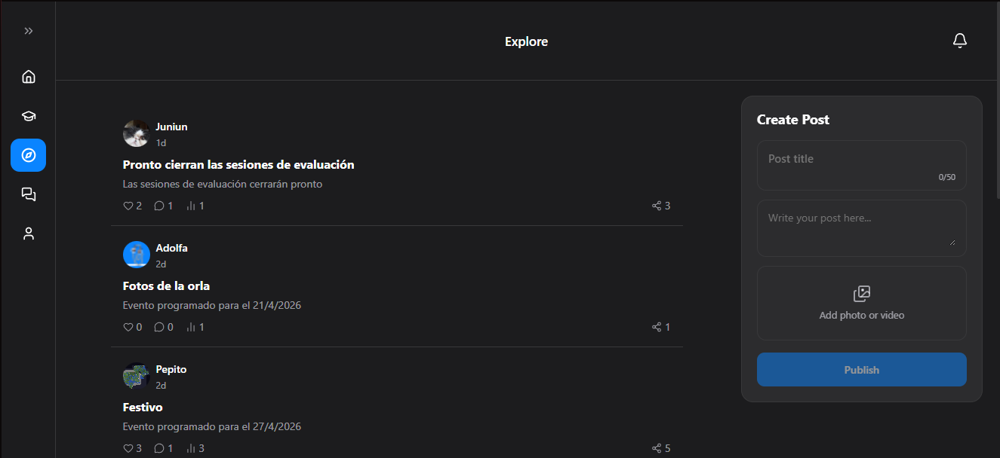
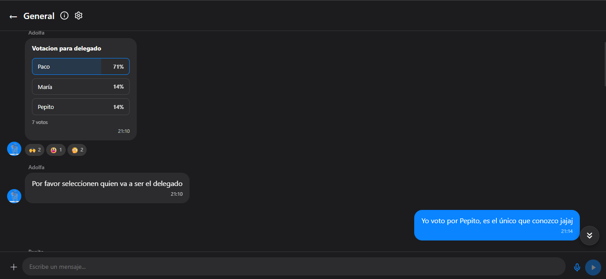
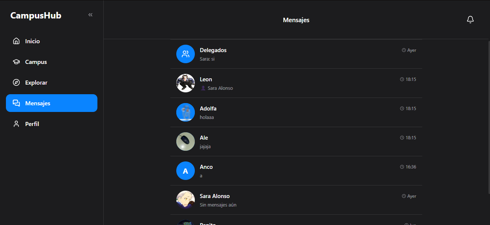
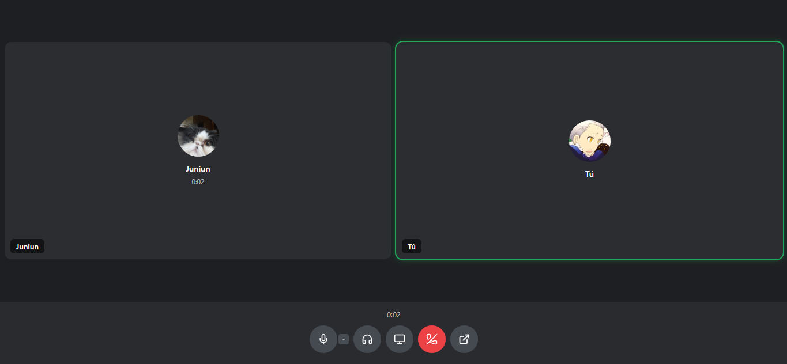
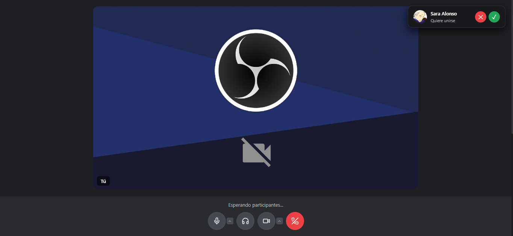
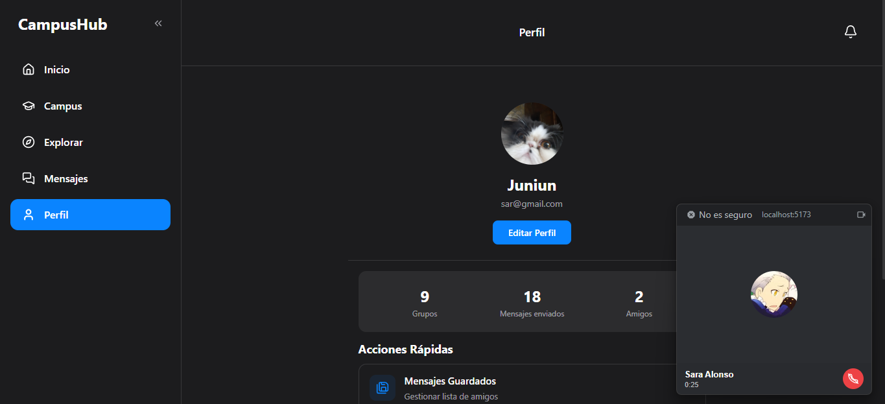
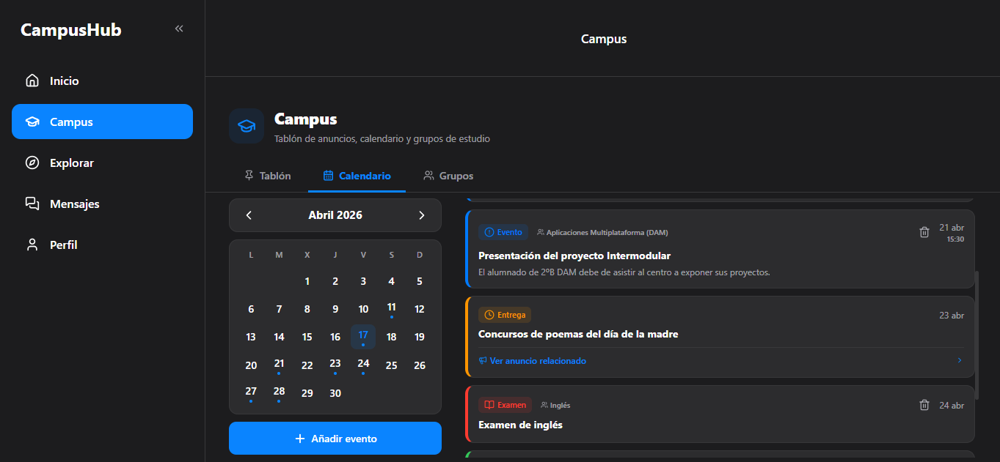
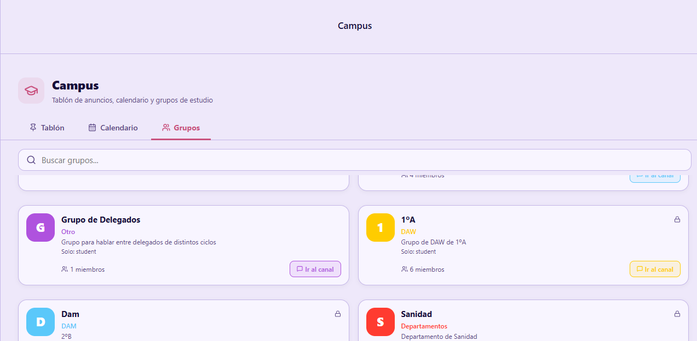
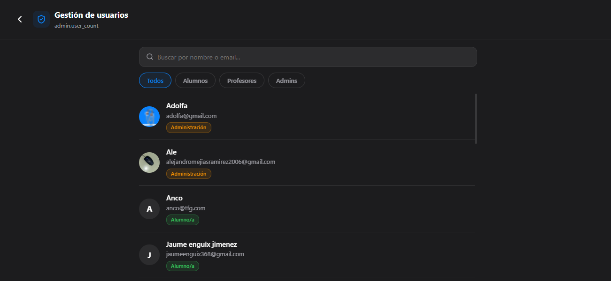

# CampusHub — Web

Plataforma web de CampusHub, el entorno virtual y social para centros educativos. Desarrollada con **React 19 + Vite + TypeScript**, ofrece paridad funcional con la app móvil e incorpora funcionalidades exclusivas como llamadas WebRTC con Picture-in-Picture, videoconferencias de grupos de estudio y panel de administración.

> Parte del monorepo [Campus-Hub](../README.md) · Equipo A&S Technologies · CIFP Villa de Agüimes 2025–2026

---

## 🌐 Demo

| Entorno | URL |
|---------|-----|
| Producción | https://campus-hub-one-alpha.vercel.app/ |

---

## 📸 Capturas

<details>
<summary>Home & Feed social</summary>




</details>

<details>
<summary>Mensajería y canales</summary>




</details>

<details>
<summary>Llamadas y videoconferencias</summary>





</details>

<details>
<summary>Campus — tablón, calendario y grupos de estudio</summary>




</details>

<details>
<summary>Panel de administración</summary>



</details>

---

## 🏗️ Estructura del proyecto

```
web/
├── public/                  # Assets estáticos
└── src/
    ├── assets/              # Imágenes y recursos locales
    ├── components/          # Componentes reutilizables
    │   ├── call/            # CallScreen, GroupCallScreen, ConferenceScreen
    │   ├── campus/          # AnnouncementsTab, CalendarTab, GroupsTab, GroupCard
    │   ├── chat/            # MessageBubble, ChannelInfoPanel, DMInfoPanel, PollModal
    │   └── messages/        # CreateGroupModal y componentes de mensajería
    ├── config/              # Inicialización de Firebase
    ├── contexts/            # Providers globales (Call, Theme, Language, Notifications…)
    ├── hooks/               # Custom hooks por dominio
    ├── locales/             # Traducciones ES / EN (>878 claves)
    ├── pages/
    │   ├── admin/           # Panel de administración (AdminUsers)
    │   ├── auth/            # Login y Register
    │   ├── campus/          # Detalle de anuncio
    │   ├── chat/            # Chat de canal, DirectChat, GroupChat
    │   ├── main/            # Home, Campus, Explore, Messages, Events, Support…
    │   ├── posts/           # Detalle y edición de post
    │   └── settings/        # Configuración, perfil, temas, cuentas, eliminar cuenta
    ├── services/
    │   └── firebase/        # Servicios por dominio (calls, DMs, grupos, eventos…)
    ├── types/               # Tipos e interfaces TypeScript globales
    ├── utils/               # Helpers (formateo de fechas, colores…)
    ├── App.tsx              # Enrutador principal + providers globales
    └── index.css            # Estilos globales y variables CSS
```

---

## ✨ Funcionalidades

### Comunicación
- Canales públicos, privados y de anuncios organizados por departamento y ciclo
- Mensajería en tiempo real con respuestas citadas, reacciones emoji y reenvío
- Mensajes de voz con visualización de waveform
- Archivos adjuntos: imágenes, documentos PDF y contactos
- Mensajería directa 1 a 1 y grupos de conversación privados
- Temas de chat personalizables por usuario (colores y fondos)
- Búsqueda de mensajes dentro de un canal con `Ctrl+F`
- Encuestas en canales y chats directos

### Red social
- Feed con posts de texto, imágenes, vídeos y música (Jamendo API)
- Sistema de amigos bilateral: solicitudes, aceptación y mejores amigos
- Explore para descubrir compañeros de otros ciclos y departamentos
- Guardado de mensajes y posts para referencia posterior

### Campus
- Tablón de anuncios con creación restringida por rol
- Calendario interactivo con tipos: examen, evento, festivo, clase y entrega
- RSVP a eventos con conteo de asistentes
- Grupos de estudio: creación, búsqueda, unirse/abandonar y videoconferencias integradas

### Llamadas y videoconferencias
Ver la [sección detallada](#-sistema-de-llamadas-y-videoconferencias) más abajo.

### Seguridad y administración
- Sistema de roles: `student`, `teacher`, `admin` con subroles `delegate` y `coordinator`
- Panel de administración: gestión de usuarios, roles y moderación de contenido
- Sistema de reportes con revisión desde el panel de administración
- Tickets de soporte con chat integrado entre usuario y staff
- Eliminación de cuenta con limpieza completa en Firestore, grupos de DM y grupos de estudio

### Experiencia de usuario
- Internacionalización completa ES / EN
- Multi-cuenta: gestión de varias sesiones desde el mismo dispositivo
- Persistencia de sesión con caducidad automática de 30 días
- Dark mode siguiendo la preferencia del sistema
- Notificaciones push mediante Firebase Cloud Messaging (FCM)

---

## 📞 Sistema de llamadas y videoconferencias

Esta es la funcionalidad técnicamente más compleja y más exclusiva de la plataforma web.

### Tipos de llamada

| Tipo | Descripción | Componente |
|------|-------------|-----------|
| Llamada 1 a 1 | Voz o vídeo entre dos usuarios desde un DM | `CallScreen.tsx` |
| Llamada grupal | Voz o vídeo en grupos de conversación privados | `GroupCallScreen.tsx` |
| Videoconferencia | Sala de grupos de estudio con sala de espera y control de admisión | `ConferenceScreen.tsx` |

### Arquitectura WebRTC

- Cada llamada crea un `RTCPeerConnection` con servidores STUN públicos de Google para NAT traversal.
- La **señalización** se realiza íntegramente a través de Firestore sin servidor dedicado: la colección `calls` almacena `offer`, `answer` y el estado de cámara/micrófono de cada participante. Los ICE candidates se intercambian en subcolecciones `callerCandidates` / `receiverCandidates`.
- Las **videollamadas grupales** implementan una arquitectura **mesh P2P completa**: cada participante establece una conexión directa con todos los demás. La función `getConnectionId(uid1, uid2)` genera un ID determinista por par y la subcolección `connections` dentro de `groupCalls` gestiona el estado de cada conexión bilateral.
- Un sistema de `pendingCandidates` resuelve la race condition en la que los ICE candidates llegan antes de que `remoteDescription` esté establecido.

### Gestión de estado

Todo el estado de llamadas se centraliza en `CallContext.tsx`, que expone métodos para iniciar, aceptar, rechazar y finalizar los tres tipos de llamada, además de gestionar la cola de llamadas entrantes y el estado `awaitingConference` (sala de espera de conferencias).

### Funcionalidades exclusivas de la plataforma web

- **Document Picture-in-Picture** (Chrome 116+): abre la llamada en una ventana flotante independiente del navegador, permitiendo navegar con total libertad. Incluye polyfill basado en canvas para navegadores sin soporte nativo.
- **Compartición de pantalla** con `getDisplayMedia()`.
- **Selector avanzado de dispositivos** con `navigator.mediaDevices.enumerateDevices()` para elegir micrófono, cámara y altavoz de forma independiente.
- **Procesamiento de audio** con `AudioContext`, `GainNode` (control de volumen por stream) y `AnalyserNode` (detección de actividad de voz para el indicador visual de quién habla).
- **Banner flotante minimizado** arrastrable (280×200 px) con avatar y duración de llamada, visible mientras el usuario navega por otras secciones.
- **Modo deafen**: silencia el audio remoto y desactiva el micrófono local simultáneamente.
- **Control de admisión en conferencias**: el anfitrión aprueba o rechaza participantes desde una sala de espera antes de entrar.

### Detección de desconexión

Funciona en tres niveles independientes:
1. Cambio de `status` a `'ended'` en Firestore detectado por `onSnapshot`.
2. Listeners `beforeunload` y `pagehide` para auto-leave cuando el usuario cierra la pestaña.
3. Timeout de 45 segundos para llamadas no contestadas que ejecuta `missCall()` automáticamente.

---

## 🚀 Despliegue local

### Requisitos previos

- Node.js 18+
- Proyecto en [Firebase](https://firebase.google.com) configurado (Auth, Firestore, Storage, FCM)

### Instalación

```bash
cd web
npm install
```

### Variables de entorno

Crea un archivo `.env` en `web/` a partir de `.env.example`:

```env
VITE_FIREBASE_API_KEY=
VITE_FIREBASE_AUTH_DOMAIN=
VITE_FIREBASE_PROJECT_ID=
VITE_FIREBASE_STORAGE_BUCKET=
VITE_FIREBASE_MESSAGING_SENDER_ID=
VITE_FIREBASE_APP_ID=
VITE_FIREBASE_MEASUREMENT_ID=
```

### Iniciar en desarrollo

```bash
npm run dev
# http://localhost:5173
```

### Build de producción

```bash
npm run build      # Genera dist/
npm run preview    # Sirve el build localmente
```

### Despliegue en Vercel

```bash
vercel --prod
```

O conectando el repositorio en [vercel.com](https://vercel.com) con el directorio raíz configurado como `web/`.

---

## 🧰 Tech Stack

| Capa | Tecnología |
|------|-----------|
| Framework | React 19 + Vite |
| Lenguaje | TypeScript |
| Autenticación | Firebase Auth (email/contraseña + Google Sign-In) |
| Base de datos | Cloud Firestore (tiempo real con `onSnapshot`) |
| Almacenamiento | Firebase Storage (documentos) + Cloudinary (imágenes/vídeos) |
| Notificaciones | Firebase Cloud Messaging (FCM) |
| Llamadas | WebRTC con señalización vía Firestore |
| i18n | Sistema propio con >878 claves ES / EN |
| Iconos | Lucide React |
| Routing | React Router v6 |
| Despliegue | Vercel |

---

## 👤 Autora

**Sara Alonso Perdomo** — Plataforma web completa, Google Sign-In, panel de administración, sistema de llamadas WebRTC y validación funcional.

Proyecto **A&S Technologies** · CIFP Villa de Agüimes · 2025–2026
